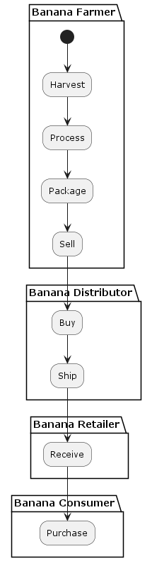
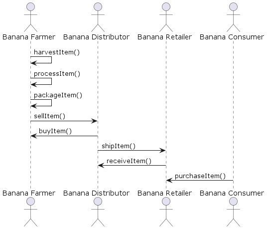
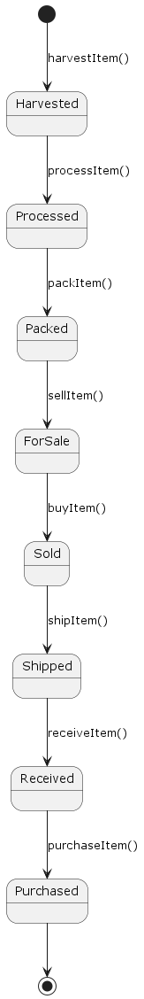
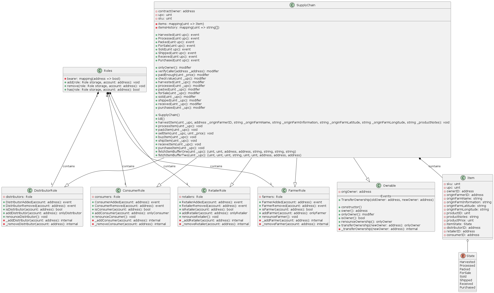

# Supply chain & data auditing

This repository containts an Ethereum DApp that demonstrates a banana supply chain flow between a farmer, distributor, retailer and consumer. The user story is similar to any commonly used supply chain process.

## Deployed on Sepolia Test Net

The supply chain contract has been deployed on the sepolia test net.

Transaction: https://sepolia.etherscan.io/tx/0xde44f3772f7c494e7447e5ba33251602014c5b4a4be3c838426e15caf5797fc7

Contract: https://sepolia.etherscan.io/address/0xae5ec9ccd3dc0f3fd9ed6ccec99a1d69250c31f7#code

## Architecture & UML diagrams

### Activity diagram

Below activity diagram highlights how the banana flows through the supply chain movin between actors.



### Sequence diagram

The sequence diagram shows the methods called during the supply chain flow.



### State diagram

The state diagram visualises the different states.



### Class diagram

The class diagram shows the classes, methods, attributes and relations.



## Frontend & UI

The DApp User Interface when running should look like...


## Getting Started

These instructions will get you a copy of the project up and running on your local machine for development and testing purposes. See deployment for notes on how to deploy the project on a live system.

### Prerequisites

Please make sure you've already installed ganache-cli (v6.12.2 with ganache-core 2.13.2), Truffle (v4.1.14) and enabled MetaMask extension in your browser. Also node (v12.16.1) and web3 (^1.8.1) are used.

### Installing

> The starter code is written for **Solidity v0.4.24**. At the time of writing, the current Truffle v5 comes with Solidity v0.5 that requires function _mutability_ and _visibility_ to be specified (please refer to Solidity [documentation](https://docs.soliditylang.org/en/v0.5.0/050-breaking-changes.html) for more details). To use this starter code, please run `npm i -g truffle@4.1.14` to install Truffle v4 with Solidity v0.4.24.

A step by step series of examples that tell you have to get a development env running

Clone this repository:

```
git clone https://github.com/udacity/nd1309/tree/master/course-5/project-6
```

Change directory to `project-6` folder and install all requisite npm packages (as listed in `package.json`):

```
cd project-6
npm install
```

Launch Ganache:

```
ganache-cli -m "spirit supply whale amount human item harsh scare congress discover talent hamster"
```

Your terminal should look something like this:


In a separate terminal window, Compile smart contracts:

```
truffle compile
```

Your terminal should look something like this:


This will create the smart contract artifacts in folder `build\contracts`.

Migrate smart contracts to the locally running blockchain, ganache-cli:

```
truffle migrate
```

Your terminal should look something like this:


Test smart contracts:

```
truffle test
```

All 10 tests should pass.


In a separate terminal window, launch the DApp:

```
npm run dev
```

## Built With

- [Ethereum](https://www.ethereum.org/) - Ethereum is a decentralized platform that runs smart contracts. It is used as the blockchain in this project.
- [Solidity](https://soliditylang.org/) - Solidity is a statically-typed curly-braces programming language designed for developing smart contracts that run on Ethereum. It is used to write the supply chain smart contracts in this project.
- [Truffle Suite](https://trufflesuite.com/) - Truffle is a suite of tools for smart contract development. Truffle is managing contract artifacts and includes contract testing. Ganache as part of the suite is used to run a local Ethereum blockchain to run tests, execute commands, and inspect state while controlling how the chain operates.
- [web3.js](https://web3js.org/) - Web3.js is a JavaScript library for building on Ethereum. It enables the interaction with smart contracts as JS objects, e.g. to get block and state information. In this project it is used to connect the UI to the smart contract and allow interaction.
